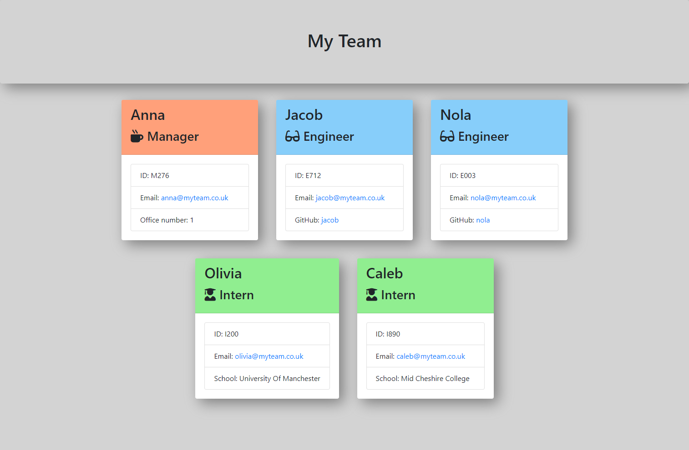

# Team Profile Generator 

## Description
This project takes in information on the command-line about employees on a software engineering project, to then generate a HTML webpage with summaries for each person. This is intended for use by the project team manager to allow clear and easy access to emails and GitHub profiles.

On the command-line, the user can select employees by role type, adding whatever quantity of employees are needed. Role types are grouped and have been colour-coded on the HTML webpage to visually organise employees.

The application uses Jest for running unit tests and Inquirer for collecting input from the user. Validation of the command-line inputs has also been included to ensure correct input formats.

On completion of the project I have developed my knowledge of uses for Jest and Inquirer specifically, and also become more familiar with using regex for validation. Building on the starter code has allowed me to understand how to piece together a project which dynamically creates a HTML webpage.

## Installation Instructions
To install neccessary dependancies run the command below. Versions used are Jest 29.7.0 and Inquirer 6.5.2

      npm i
    

  
## Usage
The application will be invoked using the following command:

      node index.js

&nbsp;

See below screenshot of a sample team webpage generated using the application:

## Credits

Stoilov, R. (2020, August 24). *How to clear wrong input in Inquirer.js*. Stack Overflow. https://stackoverflow.com/questions/62798907/how-to-clear-wrong-input-in-inquirer-js

Greens, O. (n.d.). *Crafting an Email Validation Regex in JavaScript*. emaillistvalidation. https://emaillistvalidation.com/blog/email-validation-in-javascript-using-regular-expressions-the-ultimate-guide/

## License
MIT

## Tests
To run all tests run the following command:

      npm run test:all
   
## Information
You can find more of my work at [ClairePriceGitHub](https://github.com/clairepricegithub)
